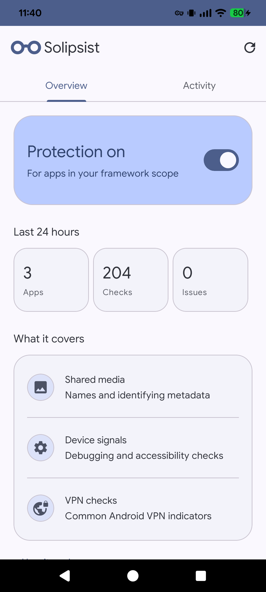
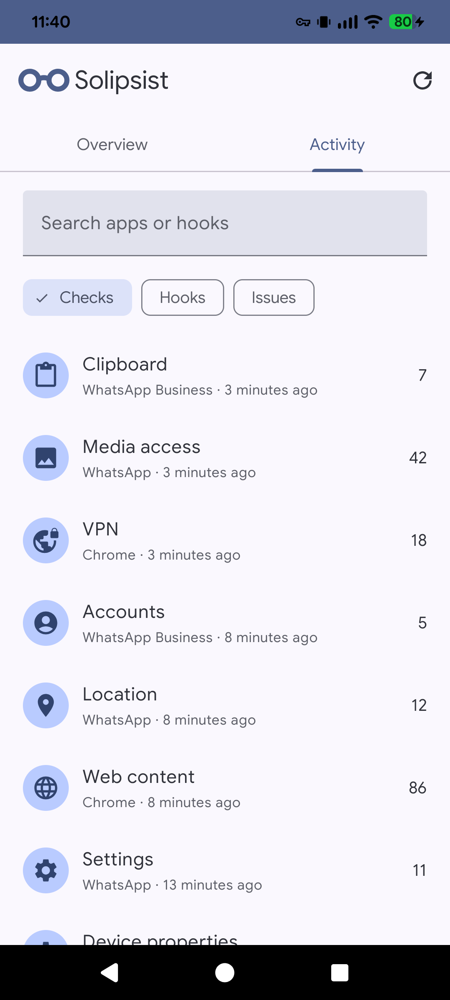

# Solipsist

An Xposed privacy module for Android. Solipsist reduces identifying details in shared media and masks common device and VPN checks for scoped apps.

  
  

Screenshots show sample activity.

## Install

1. Install the signed APK from [Releases](https://github.com/bgwastu/solipsist/releases). Root and an active LSPosed-compatible framework are required.
2. Enable Solipsist for **System Framework**, **Settings Storage**, the installed **Media Storage** package, and the apps you want protected. Reboot.
3. Open Solipsist to review protection and activity.

VPN provider and system apps are exempt. Network exit IPs and native checks can still reveal a VPN.

## Build

With JDK 21 and an Android SDK, run `./gradlew :app:assembleDebug`.

## License

[MIT](LICENSE).

AI disclosure: Human validated.
